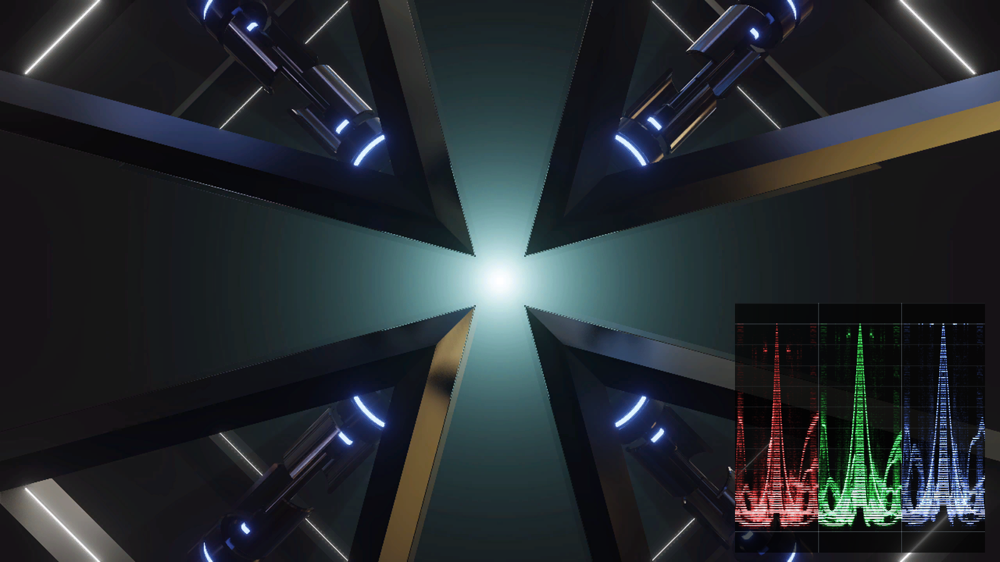
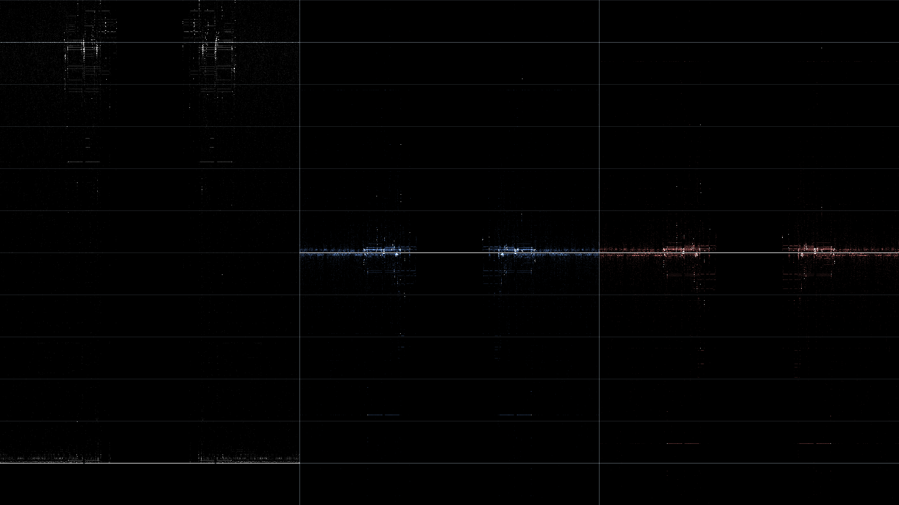
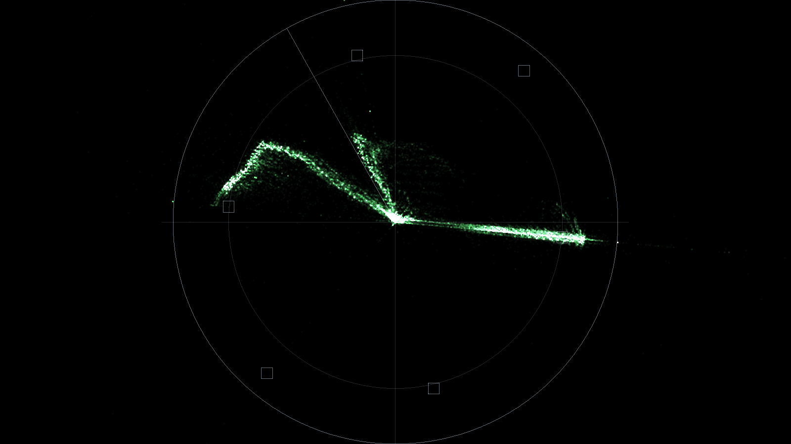
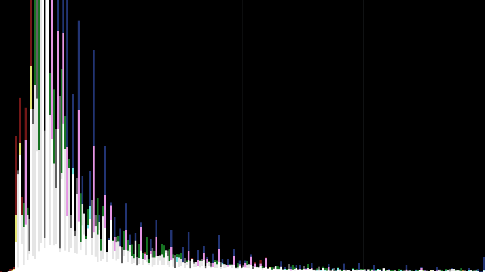
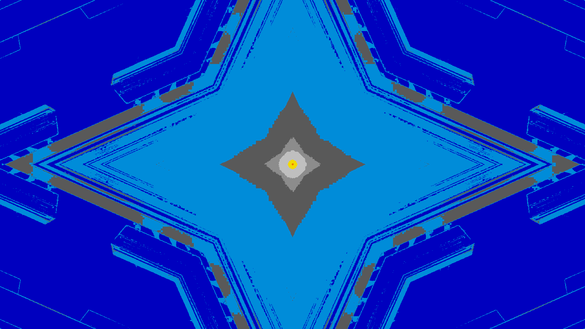

# Scopes

> **AI-assisted project.** This codebase was created with [Claude](https://claude.com/claude-code)
> (Anthropic), directed and reviewed by a human author. The measurement is
> verified numerically by an offline harness that drives the real plugin class in
> a headless GL context: the trace is checked against 75% and 100% colour bars in
> all three matrices, and the GLSL is measured against an independent C++
> implementation (see [Status](#status)). It has **never been loaded into
> Resolume** — only compiled, rendered and measured offline. Check it in your own
> rig before trusting it in a show.

Waveform, vectorscope, histogram and picture assist as a single FFGL effect for
Resolume Arena and Avenue. Drop it on a layer and it measures whatever is
arriving at that point in the chain — either replacing the picture or sitting
over it.



| Scope | Modes |
|---|---|
| **Waveform** | Luma · RGB parade · Y Cb Cr parade |
| **Vectorscope** | 75% / 100% targets, 1× to 8× zoom, skin-tone line |
| **Histogram** | RGB · Luma · RGB + Luma, 256 bins |
| **Picture Assist** | False colour · Zebra · Focus peaking |

| | |
|---|---|
|  |  |
| Y Cb Cr parade — luma, then the two colour differences centred on chroma zero | Vectorscope — target boxes and the skin-tone line, both derived from the selected matrix |
|  |  |
| Histogram — RGB and luma together; overlaps add, so white means all four agree | False colour — the exposure scale, from crushed blue through to clipping |

Every image above is one frame of Resolume's own bundled demo media pushed
through the shipped shaders by the offline harness — regenerate them with
`tools/screenshots.sh`.

## The thing to know before you trust a reading

**A scope in Resolume never sees a video signal.** It sees whatever RGB the
engine has in the texture by the time the effect runs, and by then three
decisions have already been made and thrown away:

- which matrix took the clip from Y'CbCr to RGB (BT.601, BT.709, BT.2020),
- whether studio-range levels (16–235) were expanded to full range,
- whether the colour has been multiplied by its alpha.

None of them is recorded in the pixels, and every one of them changes the
reading. A BT.709 clip read as BT.601 throws every vectorscope target about
**5.7° off its box**. Unexpanded studio levels put reference white at **92 IRE**.
A clip at 50% layer opacity reads a stop down. Each of those looks like a mildly
misadjusted picture rather than a measurement error, which is exactly what makes
it dangerous.

So **Matrix**, **Range** and **Unpremultiply** are parameters, and this plugin
guesses at none of them. That is not a gap — it is the only honest arrangement,
because a scope that silently picks an interpretation is a scope that is
confidently wrong about half the time. Set them to match your source.

The defaults are BT.709, full range, unpremultiply on, which is what a modern
composition on a modern machine usually is. They are still defaults, not
detection.

## Building

```bash
cmake -B build -DCMAKE_BUILD_TYPE=Release && cmake --build build
```

Add `-DCMAKE_OSX_ARCHITECTURES=arm64` for a much faster single-arch dev build.
Install into Resolume's plugin folder with:

```bash
cmake --install build
```

## Controls

**Scope** — which scope, plus the mode selector for each, trace **Intensity**,
vectorscope **Zoom**, and **Quality** (how many source pixels get measured).

**Layout** — *Scope Only* replaces the picture; *Overlay* draws the scope over
it at a **Size**, **X**, **Y** and **Opacity** you choose. Picture Assist ignores
all of these: it is the picture with a different shader on it, not a rectangle
on top of one.

**Graticule** — brightness, 75%/100% **Bars** targets, and the scope's
**Background**. At Background 0 the scope has no backdrop and composites over
whatever is on the layers below.

**Signal** — Matrix, Range, Unpremultiply. See above.

**Assist** — one **Assist Level** that means the zebra threshold in IRE when
Zebra is showing and the gradient threshold when Focus Peaking is.

Intensity is a *density* control, not a brightness. The trace is drawn
additively, so it says how much one sample contributes and therefore how many
coincident samples it takes to saturate. It is normalised against the sample
count, so changing Quality changes the resolution of the measurement without
changing how bright the trace looks.

## Status

**Verified**, by `tools/verify.sh` on one M4 Max:

- Every scope reports the right number against 75% and 100% colour bars, in
  BT.601, BT.709 and BT.2020. The waveform trace lands on each bar's luma to
  within **0.08 IRE** (which is the readback's row quantisation, not the maths);
  the vectorscope trace lands within **1.2 px** of each derived target box; the
  histogram spikes in the right bin for all seven bars and nowhere else.
- The GLSL's false-colour banding agrees with the C++ `falseColourBandFor()` on
  every column of a neutral ramp, in all three matrices and both ranges.
- All 19 parameters measurably affect the output — the check that catches a
  uniform name that does not match between the C++ and the GLSL, which is
  otherwise silent.
- The macOS bundle is universal (arm64 + x86_64) and exports `plugMain`.

The expected readings are derived from `source/Colorimetry.cpp`, which is also
where the shaders' uniforms and the graticule come from — so the trace has to
land in the box, and if it does not, something between the parameter and the
pixel is wrong.

**Not verified:**

- **It has never been loaded into Resolume.** Not once. Parameter groups, the
  option dropdowns, Arena's real texture sizes, and — most importantly — whether
  the input really is premultiplied are all unconfirmed. Those are exactly what
  an offline harness cannot tell you, because it supplies its own textures.
- **The Windows build has never been run**, or compiled.
- **No performance figure has been taken.** A parade at Full quality on a 4K
  source scatters several million points a frame and nobody has measured what
  that costs.

## Diagnostics

`source/Diag.cpp` writes a log to `~/Library/Logs/resolume-scopes/` (macOS). It
exists for the one failure that actually happens — a shader that will not
compile, which from the operator's side looks like "the effect does nothing"
with no message anywhere. It names the stage and logs the GL vendor, renderer
and version next to it.

## Licence

MIT. See [LICENSE](LICENSE).
